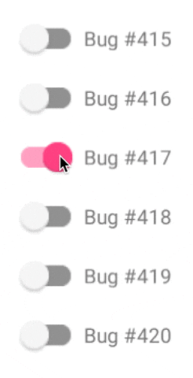

<h1 align="center">Hi 👋, I'm Jeyadheep Velayutham</h1>
<h3 align="center">A passionate ML developer from India</h3>

  

  

    <h2 >📖 About Me</h2>
    <ul>
      <li>🖥 Enthusiastic coder with a passion for problem-solving.</li>
      <li>🎓 Currently learning Full-Stack Development.</li>
      <li>📚 Focused on mastering Data Structures & Algorithms.</li>
      <li>🚀 Active participant in hackathons.</li>
      <li>🎨 Love for algorithms and art.</li>
      <li>✏️ Proficient in portrait, architectural, and nature sketching.</li>
    </ul>
  

  

    <h2>⬆ Currently Learning</h2>
    <ul>
      <li>🔨 Exploring oil painting.</li>
      <li>💻 Practicing coding challenges on LeetCode.</li>
    </ul>
  

---

## 💻 Tech Stack:
 
 
 
 
 
 
 
 
 
 
 
 
  
 
 
 

## 📊 GitHub Stats: 

  

    
  

  

    
    
  

## 🌐 Socials:
-  [LeetCode Profile](https://leetcode.com/u/backbenchdreamer/)
-  [Instagram Profile](https://instagram.com/back_bench_dreamer)
-  [Twitter Profile](https://x.com/_kitsune92)
-  [Facebook Profile](https://www.facebook.com/JeyadheepV)

