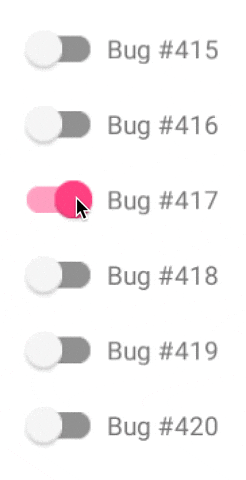

<h1 align="center">Hi 👋, I'm Jeyadheep Velayutham</h1>
<h3 align="center">A passionate ML developer from India</h3>

  

  

    <h2 >📖 About Me</h2>
    <ul>
     <li>🖥 Code wrangler, bug whisperer, and occasional stack overflow poet.</li>
     <li>🎓 Currently learning Full-Stack Development (because front-end and back-end deserve equal love... and equal frustration).</li>
     <li>📚 On a lifelong quest to understand Data Structures & Algorithms, or at least pretend convincingly.</li>
     <li>🚀 Hackathon participant: fueled by caffeine, curiosity, and the hope that the WiFi holds up.</li>
     <li>🎨 Algorithms and art, because sometimes code is just abstract painting with more semicolons.</li>
     <li>✏️ Sketches portraits, architecture, and nature. If only my code could look as good as my drawings.</li>
    </ul>
  

  

    <h2>⬆ Currently Learning</h2>
    <ul style="list-style:none; text-align:left; display:inline-block;">
     <li>🔨 Oil painting: for when pixels just aren't messy enough.</li>
     <li>💻 LeetCode challenges: because who doesn't love a good existential crisis at 2am?</li>
     <li>🌐 Cloud, DevOps, and modern JS frameworks—because I need more things to learn!</li>
    </ul>
  

---

## 💻 Tech Stack:

  
  
  
  
  
  
  
  
  
  
  
  
  
  
  
  

## 📊 GitHub Stats: 

  
  

## 🌐 Socials:
-  [LeetCode Profile](https://leetcode.com/u/backbenchdreamer/)
-  [Instagram Profile](https://instagram.com/back_bench_dreamer)
-  [Twitter Profile](https://x.com/_kitsune92)
-  [Facebook Profile](https://www.facebook.com/JeyadheepV)

